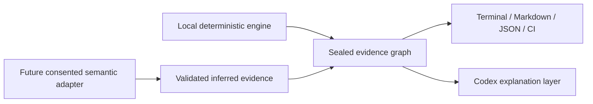

# Agent Doctor

Agent Doctor is a Codex-first, offline-first diagnostic system for Skill and
agent-configuration quality. It combines a deterministic local engine with a
model-assisted review layer while keeping evidence, authority, and privacy
boundaries explicit.

Stage 05 now provides a working Python 3.12 CLI, a sealed result graph, four
output projections, the executable Stage 04 corpus, and proposal/manual-only
repair guidance. Stage 06 is a proposed roadmap for consented semantic
analysis, longitudinal comparison, and measured qualification; it is not yet a
release claim.

## What “offline-first” means

Offline-first does **not** mean “the product must be only scripts” or “a model
is never useful.” It means the safe base layer can inventory, parse, resolve,
and preserve evidence without a network call. A model can then reason over an
explicitly disclosed, minimized evidence set, while a local adjudicator retains
the final say.



The current repository-level Agent Doctor Skill uses Codex to run and explain
the deterministic summary. It does not inspect undisclosed personal Skill
bodies or turn model opinions into findings. The full semantic adapter and
local adjudication bridge remain Stage 06 work.

## Quick start

```sh
python3 -m pip install -e .
agent-doctor scan .
```

Useful commands:

```sh
# A repository-only diagnostic suitable for local use or CI
agent-doctor scan . --project-trust trusted --format terminal

# Include user-level and locally observed Codex/plugin Skill inventory
# without claiming those files were selected at runtime
agent-doctor scan . --include-user --format terminal

# Validate and execute the reviewed contracts
agent-doctor spec run test-spec/fixtures/golden-v0.1.json --repetitions 3 --summary
agent-doctor spec run test-spec/scenarios/stage-04-catalog-v0.1.json --summary
```

Install development dependencies and run the same local gate as CI:

```sh
python3 -m pip install -e '.[dev]'
make check
```

## Repository structure

```text
.agents/skills/agent-doctor/  Codex orchestration and safe explanation workflow
.github/                      CI, optional Codex review, ownership, PR policy
docs/                         Approved contracts, implementation notes, roadmap
src/agent_doctor/             Deterministic engine and sealed result model
test-spec/                    Versioned Stage 04 schemas, fixtures, and catalog
tests/                        Executable unit, integration, and contract tests
```

The documentation index and status map live in [docs/README.md](docs/README.md).
Development and review rules are in [CONTRIBUTING.md](CONTRIBUTING.md), and the
automation design is in
[docs/architecture-and-automation.md](docs/architecture-and-automation.md).

## Continuous workflow

Every pull request runs tests across supported Python versions, type checking,
the Stage 04 golden and expanded suites, a repository-only Agent Doctor scan,
and a wheel build/install smoke test. The same deterministic gate runs weekly,
and Dependabot proposes dependency and Action updates.

An optional Codex PR review workflow is included but disabled by default. It is
advisory, read-only, restricted to same-repository pull requests, and never
receives local user-home Skill content. See the automation guide for the exact
secret, variable, branch-protection, and review setup.

No accuracy, usefulness, calibration, or release target is claimed until the
Stage 04 measurement protocol has produced sufficient evidence.
