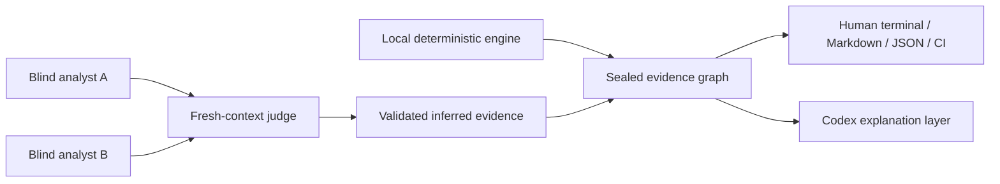

# Agent Doctor

Agent Doctor is a Codex-first, local-first diagnostic system for Skill and
agent-configuration quality. It combines a deterministic local engine with a
model-assisted review layer while keeping evidence, authority, and privacy
boundaries explicit.

Stage 05 now provides a working Python 3.12 CLI, a sealed result graph, four
output projections, the executable Stage 04 corpus, and proposal/manual-only
repair guidance. Stage 06 now enables semantic coverage by default and adds a
bounded Codex Desktop semantic exchange: exact minimized disclosure,
digest-bound execution, two blind parallel analysts, a fresh-context judge,
closed citations, constrained manual recommendations, local final
adjudication, and the same sealed result graph. This path is developmental and
unqualified; longitudinal comparison and measured qualification remain roadmap
work.

## What “local-first” means

Local-first does **not** mean “the product must be only scripts” or “a model
is never useful.” It means the safe base layer can inventory, parse, resolve,
and preserve evidence without a network call. A model can then reason over an
explicitly disclosed, minimized evidence set, while a local adjudicator retains
the final say.



The repository-level Agent Doctor Skill runs the complete bounded semantic
workflow by default for an explicit comprehensive diagnosis request. That
one-run operation generates and records an exact disclosure manifest and binds
all three calls to its digest; `semantic prepare` / `invoke` / `finalize` remain
available as an inspect-and-confirm advanced workflow. It never treats model
output as authority:
citations are validated, evidence remains inferred, and local rules decide the
diagnostic axes and whether a bounded recommendation is compatible. The two
analysts cannot see one another, receive canonical and reversed source order,
and the judge must expose disagreement; model agreement still does not become
proof. Signed-in Codex Desktop use does not
require an OpenAI API key; provider retention remains governed by the user's
account terms.

## Quick start

```sh
python3 -m pip install -e .
agent-doctor scan .
```

Useful commands:

```sh
# A repository-only diagnostic suitable for local use or CI
agent-doctor scan . --project-trust trusted --format terminal

# Compact ID-oriented troubleshooting view
agent-doctor scan . --project-trust trusted --format debug

# Include user-level and locally observed Codex/plugin Skill inventory
# without claiming those files were selected at runtime
agent-doctor scan . --include-user --format terminal

# Opt out for a deterministic-only run
agent-doctor scan . --semantic-mode disabled --format terminal

# Complete semantic diagnosis: two blind analysts, one judge, local sealing
agent-doctor semantic run . --include-user --artifact-dir build/semantic-run

# If exact narrowing leaves fewer than two Skills, the relationship panel is
# recorded as not applicable and no provider call starts.

# Validate and execute the reviewed contracts
agent-doctor spec run test-spec/fixtures/golden-v0.1.json --repetitions 3 --summary
agent-doctor spec run test-spec/scenarios/stage-04-catalog-v0.1.json --summary

# Resolve the reviewed quality-first recommendation without a model call
agent-doctor model resolve --capability semantic.reasoning_quality_first --as-of 2026-08-17

# Execute the Stage 06 routing contract (not provider qualification)
agent-doctor model spec --summary

# Prepare without a model call. With no --source, the bounded planner
# considers discovered non-inapplicable Skills.
agent-doctor semantic prepare . --include-user

# Narrow or exclude exact Skill locations when desired
agent-doctor semantic prepare . --include-user \
  --source SOURCE_A --source SOURCE_B --exclude-source SOURCE_C

# After reviewing the package, invoke and finalize with its exact digest
agent-doctor semantic invoke semantic-package.json --consent-digest sha256:EXACT
agent-doctor semantic finalize . semantic-package.json semantic-invocation.json \
  --include-user --consent-digest sha256:EXACT
```

Install development dependencies and run the same local gate as CI:

```sh
python3 -m pip install -e '.[dev]'
make check
```

## Repository structure

```text
.agents/skills/agent-doctor/  Codex orchestration and safe explanation workflow
.github/                      CI, optional Codex review, ownership, PR policy
docs/                         Approved contracts, implementation notes, roadmap
src/agent_doctor/             Engine, bounded semantic panel, human/sealed projections
test-spec/                    Stage 04 fixtures plus Stage 06 routing contracts
tests/                        Executable unit, integration, and contract tests
```

The documentation index and status map live in [docs/README.md](docs/README.md).
Development and review rules are in [CONTRIBUTING.md](CONTRIBUTING.md), and the
automation design is in
[docs/architecture-and-automation.md](docs/architecture-and-automation.md).

## Continuous workflow

Every pull request runs tests across supported Python versions, type checking,
the Stage 04 golden and expanded suites, a repository-only Agent Doctor scan,
the model-routing contract, and a wheel build/install smoke test. The same
deterministic gate runs weekly, and Dependabot proposes dependency and Action
updates.

An optional Codex PR review workflow is included but disabled by default. It is
advisory, read-only, restricted to same-repository pull requests, and never
receives local user-home Skill content. Its model and effort have reviewed
defaults and can be overridden with repository variables. A separate weekly,
read-only workflow detects official OpenAI model-documentation drift without
an API key; it never promotes a candidate automatically. See the automation
guide for the exact secret, variables, branch-protection, and review setup.

No accuracy, usefulness, calibration, or release target is claimed until the
Stage 04 measurement protocol has produced sufficient evidence.
