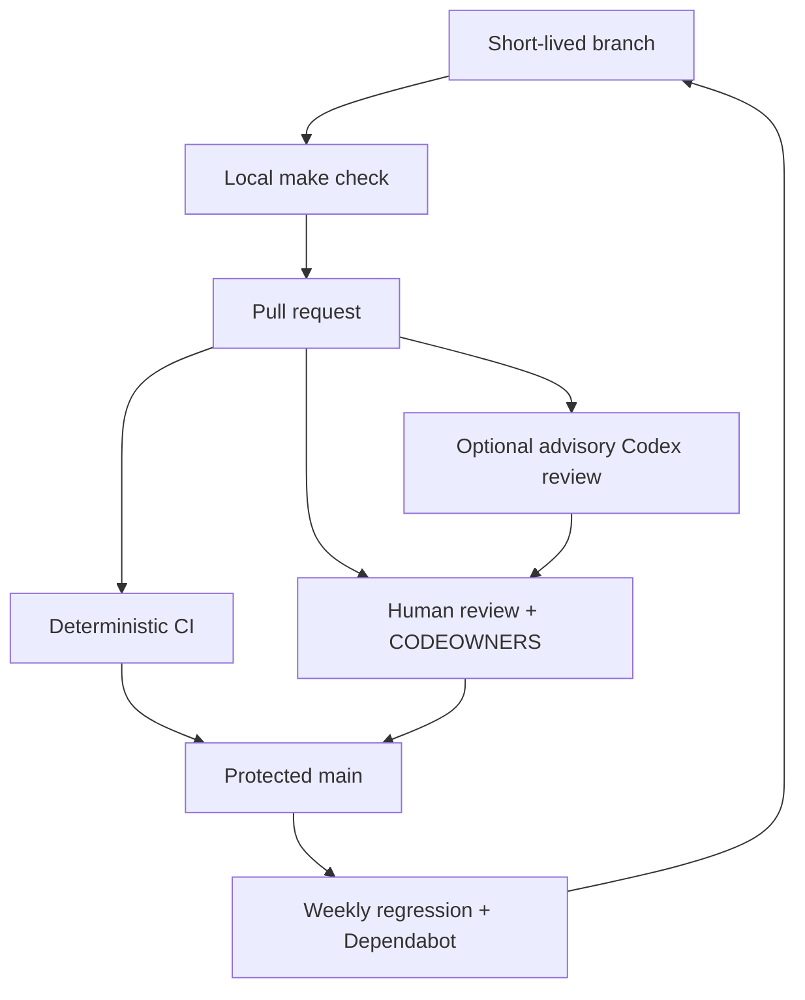

# Hybrid architecture and continuous automation

## Product shape

Agent Doctor is deliberately hybrid:

1. **Deterministic local engine.** Freeze scope, inventory every supported
   source, parse and normalize, resolve references/configuration/precedence,
   retain evidence lineage, and seal one reproducible graph without network
   access.
2. **Bounded model panel.** Use an isolated analyst for open-ended comparisons
   that are difficult to encode as rules, then use a fresh-context critic with
   reversed source order to search for counterexamples and missing evidence.
3. **Local adjudication.** Validate both identities and citations, retain model
   evidence as `inferred`, require corroboration for promotion, and decide
   state, label, severity, grouping, and compatible manual next action locally.

“Offline-first” describes layer 1 and the failure mode of the whole system. It
does not ban layer 2. If the model is disabled, unavailable, unconsented, or
unqualified, deterministic results remain usable and semantic checks remain
explicitly `not_run` or `insufficient_evidence`.

The Stage 05 CLI implements layer 1 and the result projections. The Stage 06
extension implements layers 2–3 as a three-step local exchange: prepare an
exact minimized manifest without a model call, invoke an ephemeral signed-in
Codex Desktop analyst and independent critic only after digest-specific
consent, then validate and adjudicate the cited panel locally. The same
repository Skill orchestrates both paths. Default terminal/Markdown output is
human-first, while JSON/CI and the explicit debug projection preserve the
complete technical graph and stable IDs.

Stage 06 preparation adds a reviewed, capability-based OpenAI model profile and
an offline resolver. Official recommendation, account availability, user
choice, and product qualification are separate inputs. The resolver does not
call a provider, and a newly documented model is a candidate until source
review and the applicable qualification gates promote it. The Codex Desktop
adapter uses authenticated Codex catalogue availability, which is distinct
from OpenAI API-project availability and does not require an API key.

## Repository workflow

### Deterministic CI

`.github/workflows/ci.yml` runs on pull requests, pushes to `main`, a weekly
schedule, and manual dispatch. It performs:

- unit/integration tests on Python 3.12, 3.13, and 3.14;
- mypy and bytecode compilation;
- schema validation plus G-001–G-020 repeated execution;
- the expanded Stage 04 catalog with unsupported cases retained in the report;
- the offline reviewed model-routing contract suite;
- a trusted, repository-only Agent Doctor CI scan;
- source/wheel build and clean wheel-install smoke test.

The scan's exit code preserves execution failure (`3`) separately from policy
threshold failure (`2`). GitHub marks either as a failed step, while the saved
CI envelope retains the exact reason.

Hosted CI intentionally never uses `--include-user`: GitHub runners cannot
observe the developer's real user-level Codex state, and uploading a local
home inventory would violate the default privacy boundary.

### Code review and merge policy

After the first workflow run, configure the `main` branch ruleset in GitHub:

1. require a pull request before merging;
2. require one approval and CODEOWNERS review;
3. require the `Tests`, `Contracts`, and `Package` checks;
4. dismiss stale approvals when new commits arrive;
5. require conversation resolution and block force pushes;
6. allow Dependabot PRs to use the same checks rather than bypassing them.

The repository includes CODEOWNERS and a PR template, but branch protection is
a repository setting and is therefore not silently changed by source code.

### Optional Codex pull-request review

`.github/workflows/codex-review.yml` is disabled by default. To enable it:

1. create an Actions secret named `OPENAI_API_KEY`;
2. create a repository variable named `CODEX_REVIEW_ENABLED` with value
   `true`;
3. optionally set `CODEX_REVIEW_MODEL` and `CODEX_REVIEW_EFFORT`; when absent,
   the workflow uses the reviewed `gpt-5.6-sol` / `max` defaults;
4. review `.github/codex/prompts/review.md` and the workflow's disclosure scope;
5. open a same-repository pull request from a trusted writer.

The workflow checks out the PR merge ref, runs `openai/codex-action@v1` with a
read-only sandbox and dropped sudo, and posts an advisory review comment in a
separate least-privilege job. It does not run for fork pull requests, cannot
modify the checkout, is not a required correctness gate, and never scans a
developer's user home.

This workflow reviews repository changes. It is not the Agent Doctor semantic
diagnostic adapter and does not create product findings.

### Official model profile watch

`.github/workflows/model-profile-watch.yml` runs weekly and by manual dispatch.
It fetches only the allowlisted public OpenAI Markdown sources recorded in the
reviewed profile, compares constrained fields and source digests, and retains a
drift report. It has read-only repository permissions and no API key.

A detected change fails that scheduled check so a maintainer can review the
artifact. It does not edit the profile, change the Codex review model, or
qualify a product semantic provider. Promotion requires a pull request and,
when product findings are affected, a new Stage 04 qualification run. See the
[detailed routing design](stage-06-semantic-and-model-routing-design.md).

## Longitudinal personal diagnosis

A GitHub-hosted runner is the wrong place to diagnose a personal Skill set. A
future opt-in local or dedicated private runner should:

1. run Agent Doctor locally with a frozen user scope;
2. keep the full sealed graph on the trusted machine;
3. publish only an explicitly selected, redacted summary or aggregate delta;
4. compare stable IDs and input revisions with the previous approved baseline;
5. open an issue or pull request only for attributable, reviewable repository
   changes—not mutate installed Skills unattended.

Do not attach a general-purpose self-hosted runner with home-directory access
to untrusted pull-request workflows. That design would let repository content
reach personal files and is intentionally not materialized here.

## Delivery and release boundary

The current “CD” output is a built wheel artifact for review and smoke testing.
There is no automatic PyPI publication, unattended repair, or release-status
claim. Publication can be added only after provenance/signing decisions and
the Stage 04 evidence gates are satisfied.
